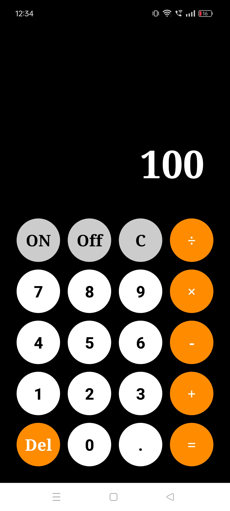

# Calculator App

Designed and developed an advanced Calculator App using Java in Android Studio. This app provides a comprehensive solution for performing a wide range of mathematical operations. The key features include basic arithmetic calculations (addition, subtraction, multiplication, division), and support for complex equations. The app also offers a clean and intuitive user interface, making it easy for users to navigate and perform calculations efficiently.

## 📷 Screenshots

<table>
  <tr>
    <td></td>
    <td></td>
  </tr>
</table>

## Features

- dark mode toggle
- Fullscreen mode
- Perform addition, subtraction, multiplication, and division with ease.
- Clear and intuitive interface for basic calculations.
- Lightweight

## ⚠️ Requirements

- Android 4.4 (API level 19) and above

## 📜 License

The library is licensed under Apache 2.0.

